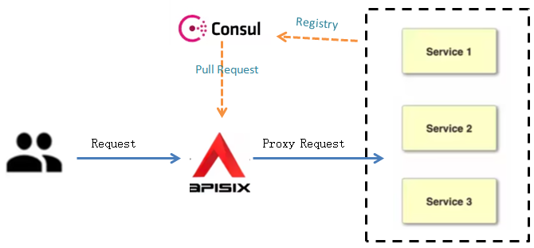

Use Consul as Service Discovery within APISIX
==========================================================

In a microservices architectures, the set of active service instances changes frequently across a large, dynamic environment. This can lead to a high maintenance cost if the upstream service information are managed with a gateway by manual configuration. Therefore an API Gateway with service discovery integration is necessary for dynamically routing requests to the appropriate services. 

HashiCorp Consul is a popular open source service networking solution that automates network configurations and discovers services.

APISIX supports to integrate with HashiCorp Consul to help discover, track, and monitor the health of services within a network.

This guide will show you how to configure Consul as the service discovery of APISIX, which mainly covers the following parts:

- :ref:`pres`
- :ref:`consul`
- :ref:`register`
- :ref:`route`

.. _pres:

Prerequisites
-----------------

- Install `Docker <https://docs.docker.com/get-docker/>`_ .
- Complete `Get APISIX <https://docs.api7.ai/apisix/getting-started/>`_ to install APISIX and containerized etcd.      
- Install `Consul with docker <https://developer.hashicorp.com/consul/tutorials/day-0/docker-container-agents>`_ and start a consul agent in the development mode (for demo only).
- Install `cURL <https://curl.se/>`_ to send requests to the services for validation.

.. _consul:

Set up an APISIX Instance with Consul
--------------------------------------

This section describes how to set up the APISIX configurations to configure Consul as the service discovery mechanism. 

1. Edit the Apache APISIX configuration file ``./conf/config.yaml`` and add the following Consul information. 

::

   discovery:
       consul:
          servers:
            - "http://127.0.0.1:8500"     # Replace with the real address of consul.

.. Note::
   | Keep the port as 8500 here because 8500 is the reuqired port for Consul to perform the HTTP API operation. 

2. Restart APISIX for the configuration changes to take effect.

.. _register:

Register Services to Consul
-------------------------------------

This section describes how to register the upstream services of your interests into Consul using the API. 

1. Make an HTTP API request to register services into Consul.

::

    curl -X PUT 'http://127.0.0.1:8500/v1/agent/service/register' \
    -d '{
      "ID": "service_web1",        # specify a unique ID for the service 
      "Name": "service_1",         # Specify a logical name for the service
      "Tags": ["primary", "v1"],   # Specify a list of tags to assign to the service
      "Address": "127.0.0.1",      # Specify the address of the service
      "Port": 9081                 # Specify the port of the service
    }'

.. Note::
   | - ``127.0.0.1:8500`` is the IP address and port of the Consul agent. Please replace it with your actual address.
   | - ``v1/agent/service/register`` is the API endpoint used to register services via HTTP API. For more information, See `Register Services <https://developer.hashicorp.com/consul/docs/services/usage/register-services-checks>`_ for details.
 
2. Check whether the service is registered successful with the following command:

::

  curl \
    http://127.0.0.1:8500/v1/agent/services

The registered services will be returned if they are registered successfully.

.. _route:

Configure Routes for Consul
-------------------------------------

This section describes how to configure a route for Consul so that the requests with the specified format will be routed to the specified upstream services. 

1. Add Consul to the route using the `Admin API <https://apisix.apache.org/docs/apisix/admin-api/>`_ provided by Apache APISIX. ``X-API-KEY`` is Admin API access token that be found in the APISIX configuration file ``config.yaml``. 

:: 

   curl http://127.0.0.1:9180/apisix/admin/routes/1 -H 'X-API-KEY: edd1c9f034335f136f87ad84b625c8f1' -X POST -i -d '
   {
       "uri": "/consul",
       "upstream": {
           "service_name": "service_web1",  # the name of the services that the request will be forwarded to
           "type": "roundrobin",
           "discovery_type": "consul"    # must be consul 
       }
   }'

In this sample route, the request with URL ``/consul`` is routed to ``service_web1`` service.

If a route is created sucessfully, the following message is returned.

::

   HTTP/1.1 201 Created
   Date: Wed, 07 Jun 2023 01:54:16 GMT
   Content-Type: application/json
   Transfer-Encoding: chunked
   Connection: keep-alive
   Server: APISIX/3.3.0
   Access-Control-Allow-Origin: *
   Access-Control-Allow-Credentials: true
   Access-Control-Expose-Headers: *
   Access-Control-Max-Age: 3600
   X-API-VERSION: v3
   
   {"key":"/apisix/routes/1","value":{"priority":0,"upstream":{"service_name":"service_1","type":"roundrobin","scheme":"http","pass_host":"pass","discovery_type":"consul","hash_on":"vars"},"uri":"/consul/*","status":1,"id":"1","create_time":1686102854,"update_time":1686102854}}

2. Make an HTTP request to APISIX with ``/consul`` to validate the results.

::

  curl http://127.0.0.1:9080/consul

